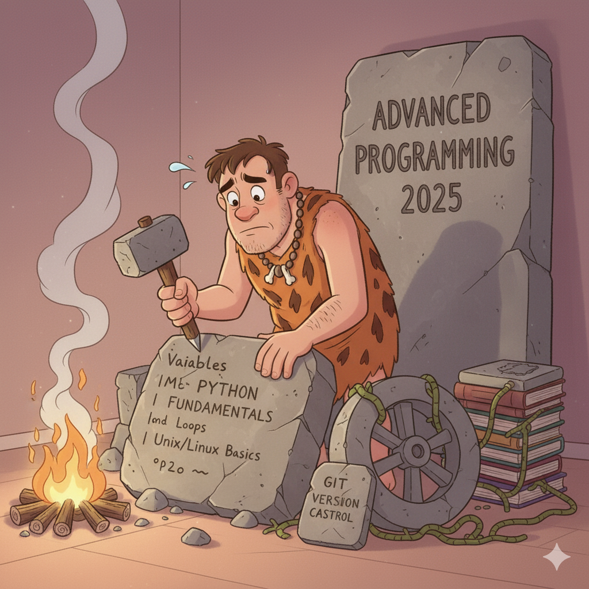
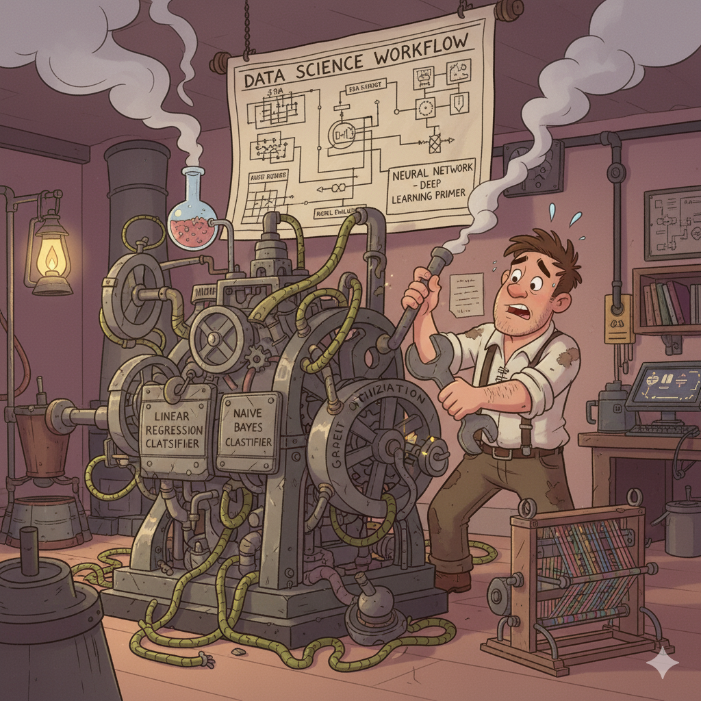
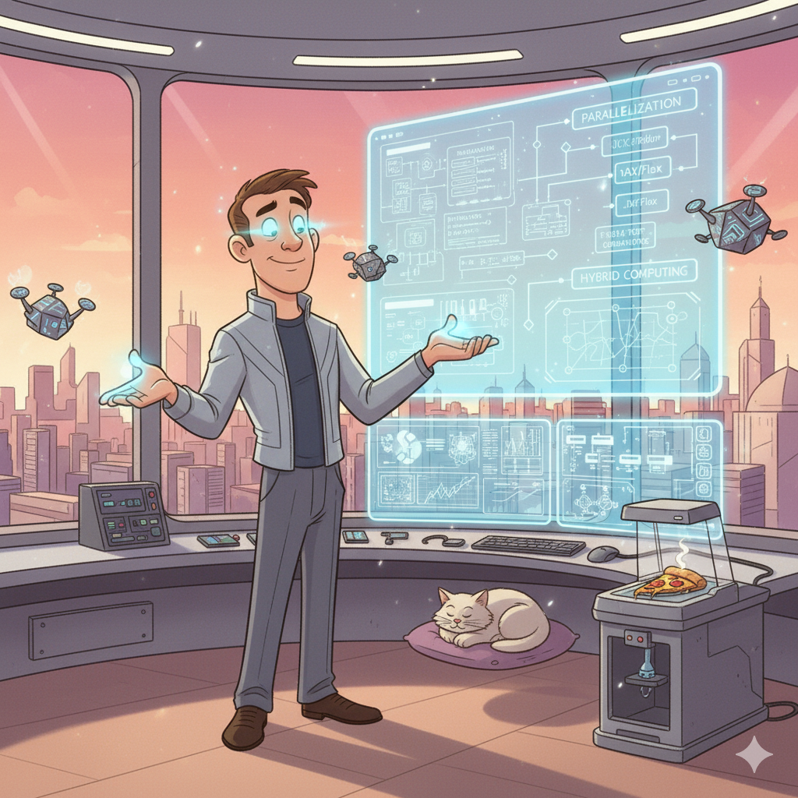
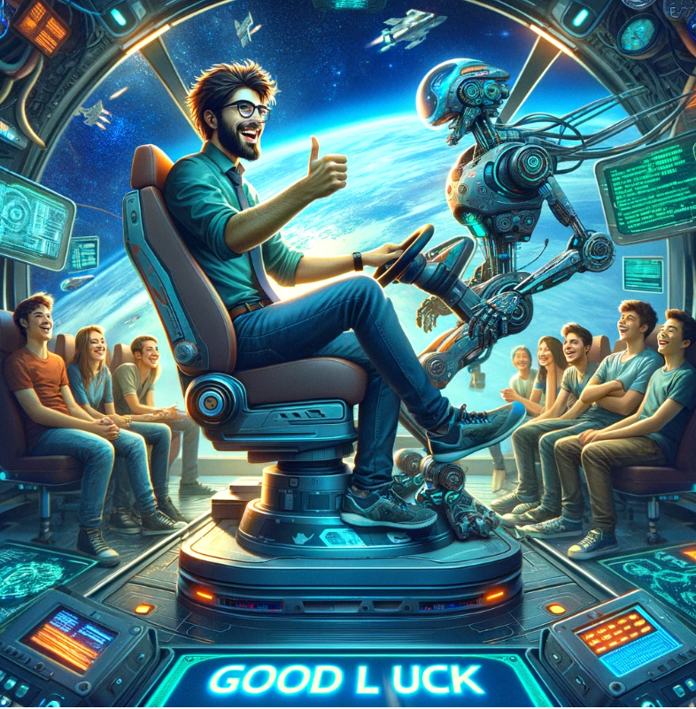

# Introduction to Data Science and Advanced Programming, HEC Lausanne, Fall Semster 2025

> **Data Scientist (n.):** *Person who is better at statistics than any software engineer and better at software engineering than any statistician.*

This advanced course introduces students to the Python programming language, core concepts of statistical learning, and high-performance computing. It is designed for Master’s students in Economics and Finance to build the computational and analytical skills necessary for modern quantitative analysis. 

The course consists of three 45-minute lecture sessions and one 45-minute hands-on session each week. 

It is offered at HEC Lausanne during the Fall Semester 2025 (Monday, September 15 - Monday, December 15, 2025).

---

## Course Website

* [Course Website](https://ap-unil-2025.github.io/course-materials/)

---

## Course Objectives  

By the end of this course, you should be able to: 

- Write clean, efficient, and well-documented Python code. 
- Manipulate and analyze data using NumPy and Pandas. 
- Create insightful visualizations with Matplotlib and Seaborn. 
- Understand the fundamental theory of statistical learning, including the bias–variance trade-off and model assessment.
- Implement and evaluate machine learning models for regression, classification, and clustering using scikit-learn. 
- Use tree-based methods and ensemble learning. 
- Gain awareness of deep learning concepts and implement a simple neural network. 
- Apply basic high-performance computing (HPC) techniques to accelerate Python code.
- Independently manage and execute a data science project from conception to presentation. 

---

## Meeting time and location  
- **Time:** Mondays, 12:30–16:00 
- **Place:** Internef 263 

**TA sessions:** Weekly on Mondays (15:15–16:00) with Anna Smirnova, Francesco Brunamonti, and Zhongshan Chen. Individual TA sessions available on Fridays upon request. 

---

## Class enrollment on the [Nuvolos Cloud](https://nuvolos.cloud/)

* All lecture materials (slides, codes, and further readings) will be distributed via the [Nuvolos Cloud](https://nuvolos.cloud/).
* To enroll in this class, please click on this [enrollment key](https://app.nuvolos.cloud/enroll/class/RshD654gzU4), and follow the steps.

---

## Video to get started with Nuvolos 

* First steps on Nuvolos: 

<iframe src="https://player.vimeo.com/video/513310246" width="640" height="360" frameborder="0" allow="autoplay; fullscreen; picture-in-picture" allowfullscreen></iframe>

---

## Approximate Schedule  

Witness the incredible transformation of a programmer throughout the course, from humble beginnings to a master of the craft!

<table style="width:100%; border:0px;">
  <tr>
    <td style="width:33%; vertical-align:top; border:0px;">
      <h3 align="center">Part I: Stone Age Programmer</h3>
      

        
      

    </td>
    <td style="width:33%; vertical-align:top; border:0px;">
      <h3 align="center">Part II: Industrial Data Era</h3>
      

        
      

    </td>
    <td style="width:34%; vertical-align:top; border:0px;">
      <h3 align="center">Part III: Future Master Programmer</h3>
      

        
      

    </td>
  </tr>
</table>

### Part I: Python Foundations (Weeks 1–6)  

**Week 1 (Sep 15): Course Overview & Setup** 
* [Lecture slides, week 1](lectures/lecture_1/slides) 
    - Topics:
      - [Introduction to the course](lectures/lecture_1/slides/Advanced_Programming_2025_lecture_1a.pdf) 
      - Structure, grading, and [capstone project](capstone_project/capstone_project.pdf) 
      - [Introduction to Nuvolos cloud computing platform](lectures/lecture_1/slides/Advanced_Programming_2025_lecture_1b.pdf)
      - [Unix/Linux basics](lectures/lecture_1/slides/Advanced_Programming_2025_lecture_1b.pdf)

**Week 2 (Sep 22): No Class** 
* *Swiss Federal Fast (Public Holiday)* 

**Week 3 (Sep 29): Python Fundamentals I** 
* [Lecture slides, week 3](lectures/lecture_3/slides) 
    - Topics:
      - [Python basics (variables, types)](lectures/lecture_3/slides/Advanced_Programming_2025_lecture_3a.pdf) 
      - [Control flow (loops, branching)](lectures/lecture_3/slides/Advanced_Programming_2025_lecture_3a.pdf)  
      - [String Manipulation](lectures/lecture_3/slides/Advanced_Programming_2025_lecture_3a.pdf)
      - Productivity: [Git version control](lectures/lecture_3/slides/Advanced_Programming_2025_lecture_3b.pdf), [programming style](lectures/lecture_3/slides/Advanced_Programming_2025_lecture_3c.pdf) (if time permits) 

**Week 4 (Oct 6): Python Fundamentals II** 
* [Lecture slides, week 4](lectures/lecture_4/slides/Advanced_Programming_2025_lecture_4.pdf) 
    - Topics:
      - Function
      - Basic Data structures (lists, tuples, dictionaries) 
      - Recursions
      - [Jupyter Notebooks (if time permits)](lectures/lecture_4/demo/jupyter_intro.ipynb) 

**Week 5 (Oct 13): Special Session: Generative AI** 
* [Lecture slides, week 5](lectures/lecture_5/slides) 
    - Topics:
      - Hands-on: Large Language Models & Autonomous agents (guest elcture by Anna Smirnova)

**Week 6 (Oct 20): Python Fundamentals III**
* [Lecture slides, week 6](lectures/lecture_6/slides) 
    - Topics:
      - [Selected Topics on Object Oriented Programming](lectures/lecture_6/slides/Advanced_Programming_2025_lecture_6b.pdf) 
      - [Selected Topics on Python Classes and Inheritance](lectures/lecture_6/slides/Advanced_Programming_2025_lecture_6c.pdf) 
      - [Recap of the Python Fundamentals (I-III)](lectures/lecture_6/demo/Python_Fundamentals_Recap.ipynb)       
      - [A complete Python Refresher (take-home materials)](python_refresher)       
      - [Basics on Program Efficiency (take-home materials)](lectures/lecture_6/slides/Advanced_Programming_2025_lecture_6c.pdf) 
      - [A preview on Libraries (take-home materials)](lectures/lecture_6/slides/Advanced_Programming_2025_lecture_6c.pdf)
      - [Productivity: Basics on Testing and Debugging (take-home materials)](lectures/lecture_6/slides/Advanced_Programming_2025_lecture_6a.pdf)
      - [Productivity: Basics on Testing and Debugging -- Notebook (take-home materials)](lectures/lecture_6/demo/debugging.ipynb)

---

### Part II: Basics of Data Science (Weeks 7–12)  

**Week 7 (Oct 27): Linear Regression** 
* [Lecture slides, week 7](lectures/lecture_8/slides) 
    - Topics:
      - [Supervised Learning - the general idea](lectures/lecture_7/slides/Advanced_Programming_2025_lecture_7.pdf)
      - Linear Regression (with multiple variables) 
      - Gradient Descent
      - Polynomial Regression 
      - Tuning Model Complexity
      - [Stock Market Prediction (if time permits)](lectures/lecture_7/slides/Stock_prediction_ML_Lecture7.ipynb)        
      - [Introduction to Pandas (quick tour; self-study)](lectures/lecture_7/demo/pandas.ipynb)
      - Further Reading: ISL Ch. 3, 5, 6. 
      - Further Reading: PML Ch. 6.3–6.5 (Bayesian linear regression, uncertainty, model comparison), Ch. 7.1–7.3 (Overfitting, generalization, cross-validation), PML Ch. 6.6 (Regularization as priors: ridge ↔ Gaussian, Lasso ↔ Laplace)

**Week 8 (Nov 3): Classification**
* [Lecture slides, week 8](lectures/lecture_8/slides) 
    - Topics:
      - [Supervised Learning: Classification](lectures/lecture_8/slides/Advanced_Programming_2025_lecture_8.pdf)
      - k-Nearest-Neighbours
      - How to evaluate Classifiers
      - [Logistic Regression](lectures/lecture_8/demo/01_Intro_Classification_Logistic.ipynb)
      - Naive Bayes (self-study)
      - Decision Trees 
      - Combining Models (Boosting, Bagging -- if time permits) 
      - Further Reading: ISL Ch. 4, Ch. 8, 
      - Further Reading: PML Ch. 8.1–8.4 (Logistic regression, generative vs discriminative classifiers), PML Ch. 8.5 (Bayesian logistic regression, optional) 

**Week 9 (Nov 10): Deep Learning Primer (I)** 
* [Lecture slides, week 9](lectures/lecture_9/slides/Advanced_Programming_2025_lecture_9.pdf)
    - Topics:
      - Deep learning basics
      - Multi-layer perceptron 
      - Feed-forward networks
      - Network training - SGD
      - Error back-propagation
      - Some notes on overfitting
      - [Introduction to Tensorflow, applied to supervised machine learning problems (Regression)](lectures/lecture_9/demo/03_Gentle_DNN.ipynb)
      - Further Reading: ISL Ch. 10 
      - Further Reading: PML Ch. 16 (Neural networks), PML Ch. 17 (Deep learning, optimization & generalization) 
      
**Week 10 (Nov 17): Deep Learning Primer (II)**       
* [Lecture slides, week 10](lectures/lecture_10/slides/Advanced_Programming_2025_lecture_10.pdf) 
    - Topics:
        - [Warm-up with Tensorflow: Approximate analytical functions](lectures/lecture_10/demo/approx_analytical_function.ipynb)   
        - [Introduction to Tensorflow, applied to supervised machine learning problems (classification)](lectures/lecture_9/demo/03_Gentle_DNN.ipynb)
        - [Introduction to PyTorch, applied to supervised machine learning problems (if time permits)](lectures/lecture_10/demo/Intro_to_PyTorch.ipynb)
        - [Introduction to Deep Learning for Sequence Modeling (Recurrent Neural Networks, LSTMs, and a first glimpse into self-attention)](lectures/lecture_10/slides/Advanced_Programming_2025_lecture_10.pdf)
        - [LSTMs applied to Ozone time series data, and stock prices (I)](lectures/lecture_10/demo/05_RNN_intro.ipynb)
        - [Neural Architecture Search: A concrete example](lectures/lecture_10/demo/simple_nas_random_search_10d.ipynb)
      
**Week 11 (Nov 24): Unsupervised Machine Learning**       
* [Lecture slides, week 11](lectures/lecture_11/slides/Advanced_Programming_2025_lecture_11.pdf) 
    - Topics:
      - k-Means
      - Gaussian Mixture Models 
      - Expectation Maximization 
      - [Principal Component Analysis - Slides](lectures/lecture_11/slides/Advanced_Programming_2025_lecture_11b.pdf)
      - [Principal Component Analysis - Notebook (if time permits)](lectures/lecture_11/demo/PCA_Intro_Lecture_11.ipynb)
      - Hierarchical Clustering (if time permits)
      - Density-based Clustering (if time permits)
      - Further Reading: ISL Ch. 10 
      - Further Reading: PML Ch. 10.1–10.4 (PCA as latent factor model), PML Ch. 11.1–11.3 (Clustering, mixture models, EM algorithm)       
*  ** Illustration of a Complete Project ** (14:00 - 16:00, by Anna Smirnova)
*  **Recap, if time permits: Best Practices in Data Science**      
    - Topics:
      - [A Grand Tour Over the Key Data Science Libraries](lectures/lecture_11/demo/Grand_Tour.ipynb)
        - [Numpy (if time permits)](lectures/lecture_11/demo/numpy.ipynb)
        - [Pandas (if time permits)](lectures/lecture_11/demo/pandas.ipynb)
        - [SciPy (if time permits)](lectures/lecture_11/demo/scipy.ipynb)
        - [Matplotlib (if time permits)](lectures/lecture_11/demo/matplotlib.ipynbb)
        - [SymPy (if time permits)](lectures/lecture_11/demo/sympy.ipynb)
        - [scikit-learn (if time permits)](lectures/lecture_11/demo/scikit_learn_intro.ipynb)
        - [PyTorch (if time permits)](lectures/lecture_11/demo/introduction_to_PyTorch.ipynb)
        - [Tensorflow (if time permits)](lectures/lecture_11/demo/tensorflow_intro.ipynb)
      - [Data Cleaning & Exploratory Data Analysis (EDA)](lectures/lecture_11/demo/DS_Workflow_Notebook_1_EDA.ipynb)
      - [Feature Engineering & Preprocessing Pipeline](lectures/lecture_11/demo/DS_Workflow_Notebook_2_FeatureEngineering_Pipeline.ipynb)
      - [Modeling, Evaluation, Thresholding & Interpretation](lectures/lecture_11/demo/DS_Workflow_Notebook_3_Modeling_Evaluation_Interpretation.ipynb)
      
---

### Part III: Advanced Programming & Wrap-Up  

**Week 12 (Dec 1): ** Introduction to High-Performance Computing**
* [Lecture slides, week 12](lectures/lecture_12/slides/Advanced_Programming_2025_lecture_12.pdf)
    - Topics
      - Concepts of shared memory parallelization
      - Concepts of distributed memory parallelization
      - Hybrid parallelization

**Week 13 (Dec 8): High-Performance Computing with Python** 
* Lecture slides, week 13: Concepts of accelerating codes in practice, and shared memory parallelization; slides 1-12 of [this lecture](lectures/lecture_12/slides/Advanced_Programming_2025_lecture_12.pdf).
    - Topics:
      - [Python for Scientific Computing - the general idea](lectures/lecture_13/demo/scientific_computing_in_python.ipynb)
      - [Numba (Numba is an open source JIT compiler that translates a subset of Python and NumPy code into fast machine code)](lectures/lecture_13/demo/numba.ipynb)
      - [Parallelization/multi-threading](lectures/lecture_13/demo/parallelization.ipynb)
      - [Multi-threading (if time permits)](lectures/lecture_13/demo/multithreading.ipynb)        
      - [Jax and Flax (self-study)](lectures/lecture_13/demo/introduction_to_JAX.ipynb)

**Week 14 (Dec 15): Capstone Project Presentations** 
    - Topics:
      - Students voluntarily present their projects 
      - Wrap-up and course summary 

## The Programmer's Journey

---

## Grading

* Every student has to provide a [**capstone project**](capstone_project/capstone_project.pdf) that illustrates what was learned.  
* Each student individually has to propose a data science project and work on it over the course of the semester.  
* The due date to submit the project is in the last week of the semester.  
* The deliverables are:  
    - i) a report of about 10 pages lengths.  
    - ii) a GitHub repository with the related code and data.  
    - iii) a video recording of a maximum of 10 minutes length that presents the project, the findings, etc.  
* We will award the grades based on whether the capstone project demonstrates an understanding of the material. **There will be no exams**.  
* There will be possibilities to collect ``bonus points'' via homework assignments.  

---

## Lecturer

* [Simon Scheidegger](https://sites.google.com/site/simonscheidegger/) (University of Lausanne, Department of Economics)  
    - Simon Scheidegger: <simon.scheidegger@unil.ch>  

---
    
## TAs and support

- Anna Smirnova <anna.smirnova@unil.ch> (TA lead)
- Francesco Brunamonti <francesco.brunamonti@unil.ch> 
- Zhongshan Chen <zhongshan.chen@unil.ch>
- Nuvolos Support: <support@nuvolos.cloud> 

---

## Google document for the QA sessions:

* [Google Doc](https://docs.google.com/spreadsheets/d/1JnbT8enDgKhR6Rfje0CjtCyMwWXdHXim4iZMpn0QE-A/edit#gid=0)

---

## References  

- Guttag, *Introduction to Computation and Programming Using Python*, MIT Press 
- Langtangen, *A Primer on Scientific Programming with Python*, Springer 
- Goodfellow, Bengio, Courville, [*Deep Learning*, MIT Press](http://www.deeplearningbook.org)  
- Murphy, [*Probabilistic Machine Learning: An Introduction*, MIT Press](http://probml.github.io/book1) 
- James, Witten, Hastie, Tibshirani, *An Introduction to Statistical Learning*, 2nd Edition – [statlearning.com](https://www.statlearning.com)  
- [QuantEcon](https://quantecon.org)

---

## Auxiliary materials 

| Session #        |  Title     | Screencast  |
|:-------------: |:-------------:| :-----:|
|   1 	| Git intro | <iframe src="https://player.vimeo.com/video/516690761" width="640" height="400" frameborder="0" allow="autoplay; fullscreen; picture-in-picture" allowfullscreen></iframe>|  
|   1 	| Terminal intro | <iframe src="https://player.vimeo.com/video/516691661" width="640" height="400" frameborder="0" allow="autoplay; fullscreen; picture-in-picture" allowfullscreen></iframe>|  
